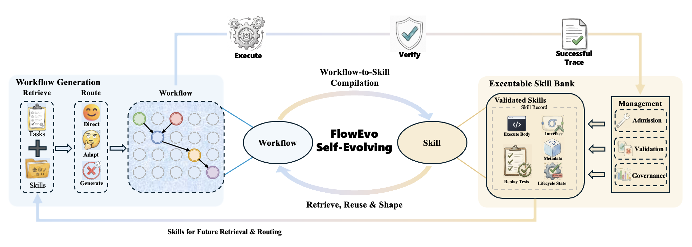

# FlowEvo

**Self-Evolving Agents through the Co-Evolution of Workflows and Executable Skills**

Published as a conference paper at the Third Conference on Language Modeling
(COLM) 2026.

**Paper:** [COLM 2026 (OpenReview)](https://openreview.net/forum?id=hU2N7IIkcE)
&nbsp;|&nbsp; [arXiv:2607.21596](https://arxiv.org/abs/2607.21596)



FlowEvo is a training-free framework for agents that improve over time by
compiling successful execution traces into reusable, directly-executable skills,
then routing future tasks to the cheapest-yet-reliable path: direct skill
replay, skill-conditioned workflow generation, or pure dynamic planning. A
governance layer continuously evaluates whether injected skills help or hurt
and suppresses those that cause negative transfer.

This repository contains the public release of the FlowEvo codebase accompanying
the paper.

## Repository layout

- `src/agent/` — planner, generator, executor, retriever
- `src/compiler/` — trace-to-skill compilation and admission
- `src/memory/` — skill registry, policy, template, primitive, and trace stores
- `src/governance/` — contrastive evaluation and utility scoring
- `src/maintenance/` — governance kernel that coordinates lifecycle updates
- `src/runtime/` — LLM client, generation settings, and config loader
- `src/core/` — shared schemas and utilities
- `src/env/` — sandbox helpers for code execution
- `src/eval/` — benchmark runner (`runner.py`) and verifier (`verifier.py`)
- `src/alfworld_/` — ALFWorld environment adapter, executor, compiler, and
  validation entry (`run_20task_validation.py`)
- `src/code_math/` — HumanEval / MBPP / GSM8K / MATH benchmark runner
- `configs/` — runtime configuration templates

## Setup

```bash
python -m venv .venv
source .venv/bin/activate
pip install -e .
```

### Configuring the LLM backend

The runtime talks to any OpenAI-compatible chat-completions endpoint through
the `openrouter` provider. `configs/default.yaml` targets
`openai/gpt-4o-mini` via OpenRouter, the shared backbone used in the paper;
point `base_url` / `model` at another endpoint to switch backbones.

Create a local override that is never committed:

```bash
cp configs/local.example.yaml configs/local.yaml
# edit configs/local.yaml to set your api_key
```

The API key can also be supplied via the `OPENROUTER_API_KEY` environment
variable.

## Running code / math benchmarks

```bash
python -m src.code_math.runner \
    --benchmark humaneval \
    --config-path configs/default.yaml \
    --output-dir runs/humaneval_demo \
    --conditions cot_baseline ours
```

Supported benchmarks: `humaneval`, `mbpp`, `gsm8k`, `math`.

Supported conditions: `io_baseline`, `cot_baseline`, `full_library`, `expel`,
and `ours` (FlowEvo's compile + reuse + adaptive-escalation pipeline).

## Running ALFWorld

```bash
python -m src.alfworld_.run_20task_validation \
    --config-path configs/default.yaml \
    --output-dir runs/alfworld_demo \
    --conditions full_library
```

Supported ALFWorld conditions: `pure_dynamic`, `compile_only`, `layer1_only`,
`layer1_2`, `layer1_3`, `full_library`, `expel`, and `no_governance`.

## Citation

If you use FlowEvo in your research, please cite our paper:

```bibtex
@inproceedings{ren2026flowevo,
  title         = {FlowEvo: Self-Evolving Agents through the Co-Evolution of Workflows and Executable Skills},
  author        = {Ren, Zeyu and Yue, Ling and Li, Ran and Wang, Yishu and Xu, Shengxiang and Liu, Hanmo and Pan, Shaowu and Di, Shimin},
  booktitle     = {Third Conference on Language Modeling (COLM)},
  year          = {2026},
  address       = {San Francisco, CA, USA},
  url           = {https://openreview.net/forum?id=hU2N7IIkcE},
  eprint        = {2607.21596},
  archivePrefix = {arXiv},
  primaryClass  = {cs.AI}
}
```

COLM proceedings are published on OpenReview and are not assigned DOIs, so the
entry carries the OpenReview `url` in place of a `doi` field.
